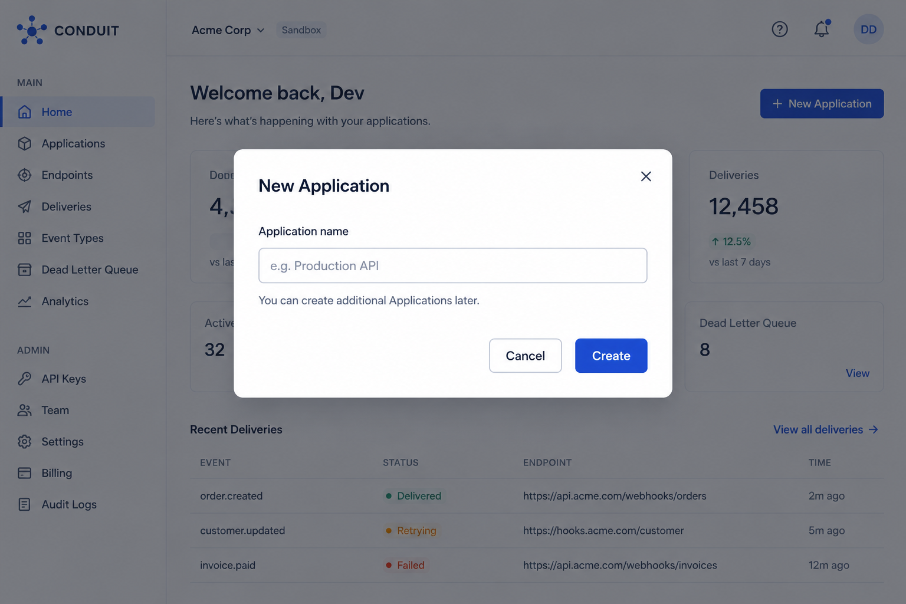
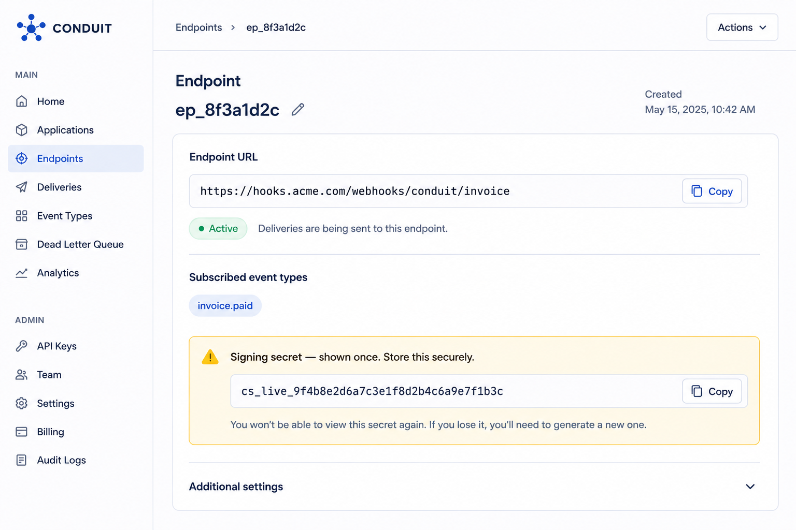

# Quickstart

This walkthrough takes you from zero to a verified webhook delivery in your Conduit Sandbox environment. Sandbox is fully isolated from Live — nothing you do here affects production data or incurs billing.

**By the end of this section, you will have:**

* Created an Application
* Generated a Sandbox API key
* Registered an endpoint and subscribed it to an event type
* Published a test event
* Verified that the delivery arrived and its signature is valid

**Prerequisites**

* A Conduit account ([sign up](../) if you don't have one)
* A publicly reachable URL to receive test deliveries. If you don't have one handy, use a request-inspection tool such as webhook.site to get a temporary URL.


**Estimated time: 5 minutes.**


## Steps



#### Create an Application

An Application is the top-level container for your integration — it holds your endpoints, events, and API keys. Every new Application starts with a Sandbox environment active by default.

* Log in to the [Conduit Dashboard](../).
* Click New Application.
* Give it a name (e.g., My First Integration) and click Create.

You're automatically placed in that Application's Sandbox environment.

<figure><figcaption></figcaption></figure>



#### Generate an API Key

API keys authenticate your requests to Conduit and are scoped to a single Application and environment.

* In your new Application, go to Settings → API Keys.
* Click Generate Key.
* Copy the key immediately. Sandbox keys are prefixed sk\_sandbox\_... and, like Live keys, are shown only once.


Security note: Treat API keys as secrets. Store them in environment variables or a secrets manager, never in source control. See Security & Compliance → Authentication & Authorization for full guidance.


Set the key as an environment variable so the examples below work as written:

```python
export CONDUIT_API_KEY="sk_sandbox_..."
```



#### Register an Endpoint

An Endpoint is a URL that receives deliveries for one or more event types. Register the test URL from your prerequisites and subscribe it to invoice.paid.



```python
import requests
response = requests.post(
    "https://api.conduit.dev/v1/endpoints",
    headers={"Authorization": f"Bearer {CONDUIT_API_KEY}"},
    json={
        "url": "https://your-test-endpoint.example.com/webhooks",
        "event_types": ["invoice.paid"]
    }
)
 
endpoint = response.json()
print(endpoint["id"])
```



```hurl
curl -X POST https://api.conduit.dev/v1/endpoints \
  -H "Authorization: Bearer $CONDUIT_API_KEY" \
  -H "Content-Type: application/json" \
  -d '{
    "url": "https://your-test-endpoint.example.com/webhooks",
    "event_types": ["invoice.paid"]
  }'
```



```javascript
const response = await fetch("https://api.conduit.dev/v1/endpoints", {
  method: "POST",
  headers: {
    "Authorization": `Bearer ${process.env.CONDUIT_API_KEY}`,
    "Content-Type": "application/json"
  },
  body: JSON.stringify({
    url: "https://your-test-endpoint.example.com/webhooks",
    event_types: ["invoice.paid"]
  })
});
 
const endpoint = await response.json();
console.log(endpoint.id);
```



The response includes the endpoint's id and a signing\_secret — save the signing secret now; it's used in Step 5 and, like an API key, is shown only once.

<figure><figcaption></figcaption></figure>



#### Send a Test Event

Publish an invoice.paid event through the Ingest API.



```python
import requests
 
response = requests.post(
    "https://api.conduit.dev/v1/events",
    headers={"Authorization": f"Bearer {CONDUIT_API_KEY}"},
    json={
        "event_type": "invoice.paid",
        "payload": {
            "invoice_id": "inv_12345",
            "amount_due": 4900,
            "currency": "usd"
        }
    }
)
 
event = response.json()
print(event["id"])
```



```hurl
curl -X POST https://api.conduit.dev/v1/events \
  -H "Authorization: Bearer $CONDUIT_API_KEY" \
  -H "Content-Type: application/json" \
  -d '{
    "event_type": "invoice.paid",
    "payload": {
      "invoice_id": "inv_12345",
      "amount_due": 4900,
      "currency": "usd"
    }
  }'
```



```javascript
const response = await fetch("https://api.conduit.dev/v1/events", {
  method: "POST",
  headers: {
    "Authorization": `Bearer ${process.env.CONDUIT_API_KEY}`,
    "Content-Type": "application/json"
  },
  body: JSON.stringify({
    event_type: "invoice.paid",
    payload: {
      invoice_id: "inv_12345",
      amount_due: 4900,
      currency: "usd"
    }
  })
});
 
const event = await response.json();
console.log(event.id);
```



Conduit matches the event against your endpoint's subscriptions and attempts delivery within seconds.


First builds typically take 1–3 minutes. Subsequent builds are faster because dependencies are cached.




### Verify Signature and Delivery

Every delivery includes a Conduit-Signature header — an HMAC-SHA256 signature computed from the delivery timestamp and raw payload, using your endpoint's signing secret. Verifying it confirms the payload genuinely came from Conduit and wasn't tampered with in transit.



```python
import hmac
import hashlib
 
def verify_signature(payload_body: bytes, timestamp: str, signature: str, secret: str) -> bool:
    signed_content = f"{timestamp}.{payload_body.decode()}"
    expected_signature = hmac.new(
        secret.encode(),
        signed_content.encode(),
        hashlib.sha256
    ).hexdigest()
    return hmac.compare_digest(expected_signature, signature)
```



```javascript
const crypto = require("crypto");
 
function verifySignature(payloadBody, timestamp, signature, secret) {
  const signedContent = `${timestamp}.${payloadBody}`;
  const expectedSignature = crypto
    .createHmac("sha256", secret)
    .update(signedContent)
    .digest("hex");
  return crypto.timingSafeEqual(
    Buffer.from(expectedSignature),
    Buffer.from(signature)
  );
}
```



Then confirm the delivery succeeded from the Dashboard:

* Go to Deliveries in your Application.
* Find the delivery for the event you just sent — it should show status Delivered with a 200 response code.




You've sent your first event. Conduit received it, matched it to your endpoint, signed it, delivered it, and logged the result — the same pipeline that handles production traffic at scale.

