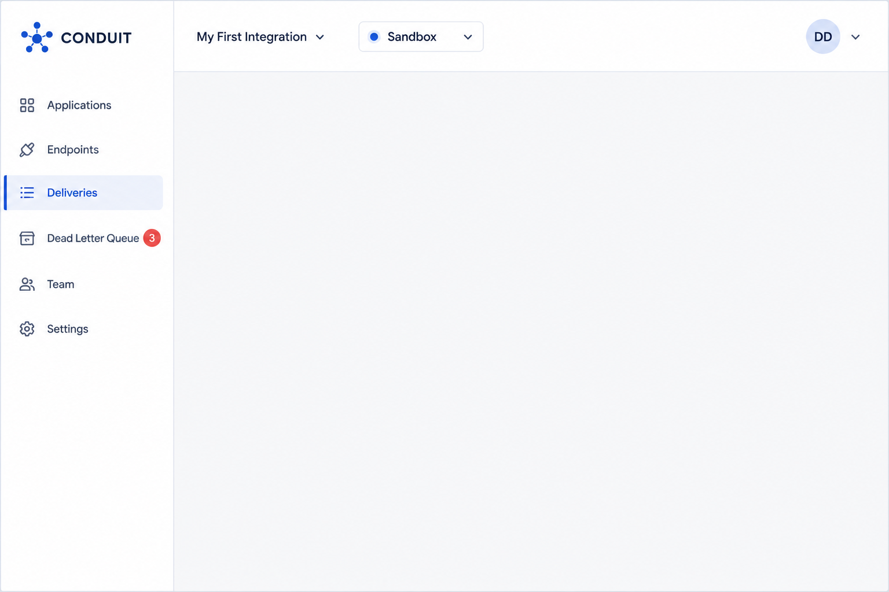
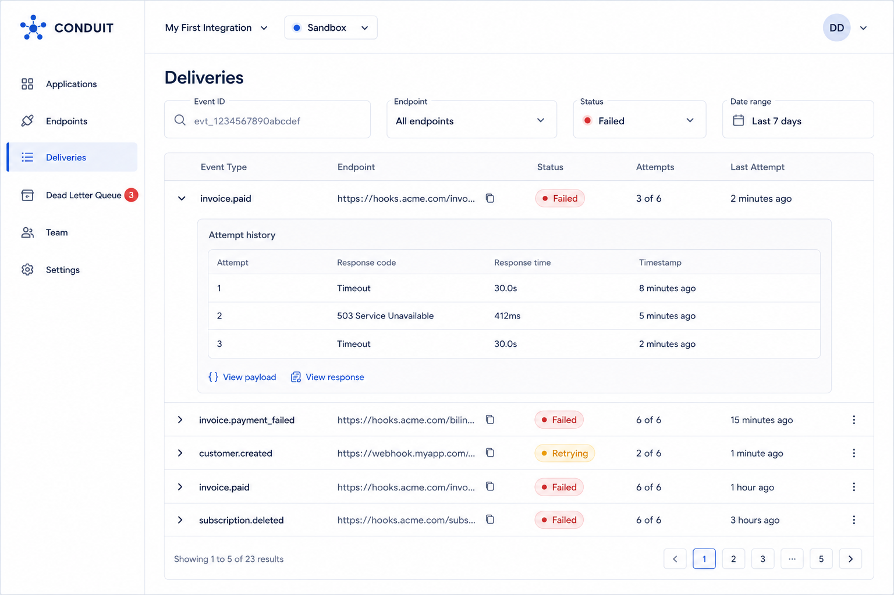
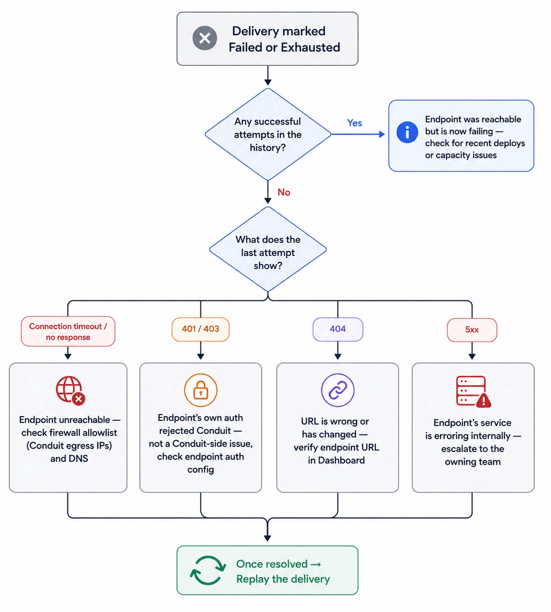
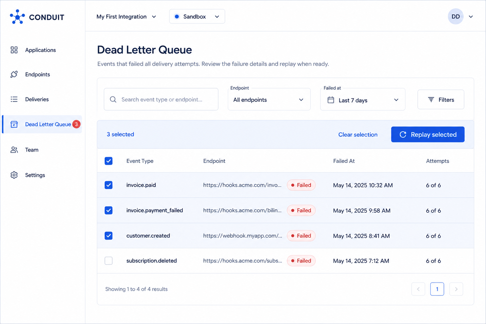

# Dashboard & Admin Guide

### Dashboard Overview and Navigation

The Dashboard provides a web interface over the same underlying data as the Admin API (see Core Concepts → How Conduit Works — the Dashboard reads from and writes to Applications, Endpoints, and the Delivery Log Store, but sits outside the delivery pipeline itself).

**Primary navigation:**

| **Section**       | **Purpose**                                          |
| ----------------- | ---------------------------------------------------- |
| Applications      | Switch between Applications within your Organization |
| Endpoints         | Register, configure, pause, and delete endpoints     |
| Deliveries        | Search and inspect delivery attempts                 |
| Dead Letter Queue | View and replay exhausted deliveries                 |
| Team              | Manage members and role assignments                  |
| Settings          | API keys, billing, environment configuration         |

An environment selector (Sandbox / Live) persists in the top navigation bar across every section — see FIG-SCREEN-04 in Getting Started. All data shown in the Dashboard is scoped to the currently selected environment; switching environments does not navigate away from the current section, only refreshes its data.

<figure><figcaption></figcaption></figure>

### Managing Applications and Environments

Creating an Application is covered in Getting Started → Step 1. This section covers ongoing management.

Renaming an Application: Settings → General → Application name. Renaming has no effect on id, endpoints, keys, or historical data — it's a display label only.

Switching environments: Use the environment selector in the top navigation (§7.1). Note that Sandbox and Live are configured entirely independently — creating an endpoint in Sandbox has no effect on Live, and vice versa (see Core Concepts → Organizations, Applications, and Environments).

Deleting an Application: Restricted to the Owner role (see Team management and role assignment, §7.7). Deletion is permanent, removes all endpoints, keys, and delivery history for both environments, and cannot be undone. The Dashboard requires typing the Application's name to confirm, as a deliberate friction point against accidental deletion.

Application creation and deletion are available only through the Dashboard, not the Admin API, in the current version (see API Reference → Applications).

### Managing Endpoints from the Dashboard

The Dashboard exposes the same endpoint operations documented programmatically in Guides → Registering and managing endpoints, through a form-based interface.

Endpoint list view shows, per endpoint: URL, subscribed event types (as chips), status badge (Active/Paused), and a rolling delivery success rate.

Creating an endpoint: Endpoints → New Endpoint opens a form for URL, event type subscriptions (multi-select), and optional retry policy overrides (defaults are pre-filled and editable).

<figure><figcaption></figcaption></figure>

**Pausing an endpoint:** From the endpoint's detail page, toggle Status from Active to Paused. The toggle is immediate — no confirmation step, since pausing is non-destructive and reversible (see Guides → Registering and managing endpoints for the behavioral implications of pausing).

**Viewing the signing secret:** The signing secret is shown once, at creation (§5.5.2). If it wasn't saved, the Dashboard cannot display it again — the only recovery path is rotation (§7.9 below, and Security & Compliance → Signing secret lifecycle and rotation).

### Reading Delivery Logs

The Deliveries screen is the primary tool for answering "did this webhook go through?" — the question the entire product exists to make answerable (see the foundation product description).

**Filtering and search:**

| **Filter** | **Use case**                                                              |
| ---------- | ------------------------------------------------------------------------- |
| Event ID   | Trace a specific event's delivery outcome across all subscribed endpoints |
| Endpoint   | Review all deliveries to one specific endpoint                            |
| Status     | Isolate failed or exhausted deliveries for triage                         |
| Date range | Scope a search to when a customer reports the issue began                 |

**Reading a delivery row:** Each row shows the event type, endpoint (truncated URL), a status badge (FIG-BADGE-01 — Delivered / Retrying / Failed), and a relative timestamp. Expanding a row reveals the full attempt history — every Delivery Attempt with its response code, response time, and timestamp (see FIG-SCREEN-03 in Getting Started for the expanded-row layout).

**Viewing a delivery's raw payload and response:** From an expanded attempt, View payload shows the exact JSON body sent, and View response shows the response body and headers the endpoint returned — essential for distinguishing a Conduit-side delivery failure from an application-level error on the receiving end.

<figure><figcaption></figcaption></figure>

### Diagnosing a Failed Delivery

This is the core support workflow (Workflow C in the product foundation) — distinguishing _why_ a delivery failed before deciding on a remediation.

<figure><figcaption></figcaption></figure>

**Walking the tree in practice:**

1. Open the failed delivery in the Deliveries screen (§7.4) and expand its attempt history.
2. Check whether any earlier attempt succeeded. A delivery with a mix of successes and failures across attempts (uncommon, since success ends the retry sequence) or a pattern of intermittent failure across _different_ deliveries to the same endpoint suggests a capacity issue rather than a hard misconfiguration.
3. Read the final attempt's response code, and match it against the table in Guides → Working with the Dead Letter Queue or the decision tree above.
4. Take the corresponding action — most commonly, contacting the customer's engineering team (for 401/403/404/5xx cases) or confirming the customer's firewall configuration (for timeouts).

This workflow is designed so Priya's persona (Support Engineer) can resolve the large majority of "webhook didn't arrive" tickets without escalating to engineering — see Persona 3 in the product foundation.

### Replaying Deliveries from the Dashboard

Once the underlying cause has been resolved (§7.5), replay is available directly from a delivery's detail view or from the Dead Letter Queue screen.

**Replaying a single delivery:** Open the delivery → Replay button → confirmation dialog stating which endpoint will receive the retry. Replay is logged as a new Delivery Attempt, visible immediately in the attempt history (see Core Concepts → Dead Letter Queue and Replay).

**Bulk replay:** From the Dead Letter Queue screen, select multiple entries (e.g., all deliveries that failed during a known outage window) and choose Replay selected. Bulk replay is subject to the same rate limits as individual replay calls (§5.3) and may be queued rather than executed instantaneously for large selections.

<figure><figcaption></figcaption></figure>

Replay does not reset an endpoint's retry policy or attempt count for future automatic retries — it is a one-time, manually triggered attempt outside the normal retry sequence.

### Team Management and Role Assignment

Conduit uses a single, consistent RBAC model applied identically across the Dashboard and Admin API. Roles are scoped per Application — see Core Concepts → Organizations, Applications, and Environments.

| **Capability**                        | **Owner** | **Admin** | **Developer** | **Viewer** |
| ------------------------------------- | --------- | --------- | ------------- | ---------- |
| View delivery logs & dashboards       | ✅         | ✅         | ✅             | ✅          |
| Create/edit endpoints                 | ✅         | ✅         | ✅             | ❌          |
| Replay deliveries                     | ✅         | ✅         | ✅             | ❌          |
| Manage API keys                       | ✅         | ✅         | ✅             | ❌          |
| Manage retry policies & event filters | ✅         | ✅         | ✅             | ❌          |
| Invite/remove team members            | ✅         | ✅         | ❌             | ❌          |
| Manage environments (Sandbox/Live)    | ✅         | ✅         | ❌             | ❌          |
| Manage billing & plan                 | ✅         | ❌         | ❌             | ❌          |
| Delete Application                    | ✅         | ❌         | ❌             | ❌          |

Inviting members is covered step-by-step in Guides → Inviting team members and assigning roles.

**Changing an existing member's role:** Team → select member → change role dropdown for the relevant Application. Role changes take effect immediately; an active Dashboard session does not need to be restarted, but a change may not be reflected in an already-open browser tab until it's refreshed.

**Removing a member:** Removes their access to the current Application only. If they hold roles on other Applications within the Organization, those are unaffected — removal is Application-scoped, consistent with how roles are assigned.

### Billing and Plan Management

Restricted to the Owner role (§7.7). Settings → Billing shows:

* Current plan tier (Free, Business, Enterprise)
* Usage against the plan's included monthly delivered-event volume, aggregated across all Applications and the Live environment only (Sandbox usage is never billed — see Getting Started → Sandbox vs. Live)
* Invoice history and payment method management

Upgrading or downgrading: Available self-service for Free ↔ Business. Enterprise plans (custom rate limits, dedicated cloud, SSO, extended data retention — see Security & Compliance → Deployment models and data residency) are provisioned through a Lattice Systems account representative rather than self-service, reflecting their custom-configured nature.

### SSO Setup (Enterprise Plan Only)

SAML-based single sign-on is available on the Enterprise plan for Dashboard authentication (not applicable to API key authentication, which is unaffected by SSO configuration — see API Reference → Authentication).

**Setup procedure:**

1. Settings → Security → Single Sign-On (visible only on Enterprise plans; Free and Business show an upgrade prompt in its place).
2. Provide your identity provider's SAML metadata URL or upload the metadata XML file.
3. Conduit generates a Service Provider (SP) metadata endpoint and ACS URL for you to configure on your identity provider's side.
4. Test the connection using the Test SSO Login button before enforcing it organization-wide.
5. Once verified, toggle Enforce SSO to require it for all Dashboard logins — existing email/password sessions are not immediately terminated but will be required to re-authenticate via SSO on next login.

Enforcing SSO does not affect API key authentication or existing automated integrations — it governs Dashboard (human) access only.

### Admin API Reference

Every operation available in the Dashboard is also available programmatically through the Admin API, with the exception of Application creation/deletion and Organization-level billing management, which are Dashboard-only in the current version (§7.2, §7.8).

For complete request/response schemas, see API Reference → Resources:

| **Dashboard action**     | **Admin API equivalent**       |
| ------------------------ | ------------------------------ |
| Endpoints screen         | /v1/endpoints (§5.5.2)         |
| Deliveries screen        | /v1/deliveries (§5.5.3)        |
| Dead Letter Queue screen | /v1/dead-letter-queue (§5.5.4) |
| Settings → API Keys      | /v1/api-keys (§5.5.5)          |

Teams that manage endpoint configuration through CI/CD rather than the Dashboard should refer to Guides → Setting up multiple environments in CI/CD, which uses these same Admin API resources.

***

#### Next Steps

* Diagnosing a specific error code or symptom not covered here → Troubleshooting & FAQ
* Programmatic equivalents of any Dashboard action → API Reference
* Security properties of authentication, signing, and data handling → Security & Compliance
* Step-by-step task instructions → Guides
